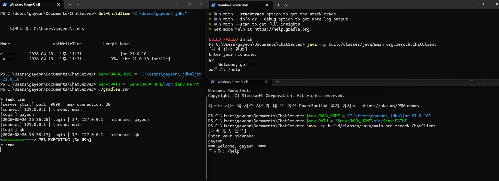
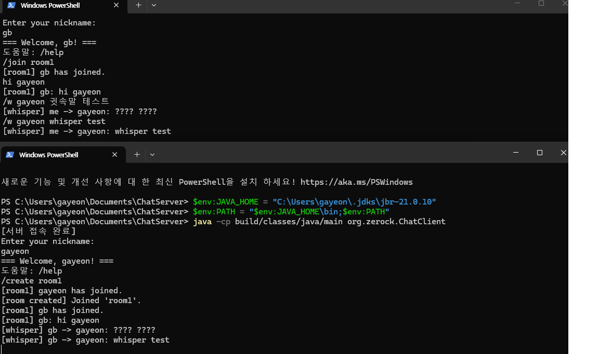

# Java 기반 멀티룸 채팅 서버

> 숭실대학교 글로벌미디어학부 · 고급자바프로그래밍실습

TCP/IP 소켓 기반의 멀티룸 채팅 서버입니다.
여러 클라이언트가 동시에 접속하여 채팅방을 생성하고 대화할 수 있으며,
Thread Pool과 ConcurrentHashMap을 활용한 멀티스레드 구조로 설계되었습니다.

---

## 기술 스택

| 항목 | 내용 |
|------|------|
| 언어 | Java 21 |
| 네트워크 | TCP Socket (`ServerSocket` / `Socket`) |
| 동시성 | `ExecutorService` (Thread Pool) |
| 자료구조 | `ConcurrentHashMap` |

---

## 파일 구조

```
src/main/java/org/zerock/
├── Main.java             # 서버 진입점
├── ChatServer.java       # TCP 서버 소켓 및 연결 관리
├── ClientHandler.java    # 클라이언트 1명 담당 스레드
├── Room.java             # 채팅방 객체
├── RoomManager.java      # 채팅방 전체 관리
├── SessionManager.java   # 세션 및 DoS 방어
├── ChatClient.java       # 테스트용 클라이언트
└── StressTest.java       # 멀티스레드 동시 접속 테스트
```

---

## 멀티스레드 구조

```
main 스레드
└── ChatServer.start()
    └── accept() 루프
        ├── 클라이언트1 접속 → Thread-1: ClientHandler.run()
        ├── 클라이언트2 접속 → Thread-2: ClientHandler.run()
        └── 클라이언트3 접속 → Thread-3: ClientHandler.run()
```

---

## 핵심 기능

### ✅ 필수 구현

- TCP Socket 서버 구현
- 다중 클라이언트 동시 접속 (Thread Pool)
- 로그인 및 닉네임 중복 방지
- 채팅방 생성 / 입장 / 퇴장
- 귓속말 (Whisper)
- 접속 로그 저장 (`access.log`)
- 서버 종료 시 안전한 자원 해제 (ShutdownHook)
- `ConcurrentHashMap` 기반 세션 관리

### ⭐ 보너스 구현

- DoS 방어 (IP별 접속 제한, Rate Limiting, 메시지 길이 제한)
- 동시 접속자 수 제한
- 멀티스레드 부하 테스트 (`StressTest.java`)

---

## 프로토콜 명세

| 커맨드 | 형식 | 설명 |
|--------|------|------|
| 로그인 | 닉네임 입력 | 서버 접속 시 닉네임 등록 |
| 방 생성 | `/create <방이름>` | 새 채팅방 생성 후 자동 입장 |
| 방 입장 | `/join <방이름>` | 기존 채팅방 입장 |
| 방 목록 | `/rooms` | 현재 생성된 방 목록 조회 |
| 채팅 | 일반 텍스트 | 현재 방 전체에 메시지 전송 |
| 귓속말 | `/w <닉네임> <메시지>` | 특정 사용자에게 1:1 메시지 |
| 방 퇴장 | `/leave` | 현재 방에서 나가기 |
| 도움말 | `/help` | 명령어 목록 출력 |
| 종료 | `/quit` | 서버 연결 종료 |

---

## DoS 방어 전략

| 항목 | 내용 |
|------|------|
| IP별 최대 접속 수 | 1개 IP당 최대 3개 연결 |
| 최대 동시 접속자 | 20명 |
| 메시지 길이 제한 | 최대 500자 |
| Rate Limiting | 1초당 최대 5개 메시지 |
| 최대 방 개수 | 20개 |

---

## 실행 방법

### 사전 준비

Java 21 이상이 설치되어 있어야 합니다.

### 서버 실행

```bash
./gradlew runServer
```

### 클라이언트 실행

새 터미널을 열고 실행합니다.

```bash
./gradlew runClient
```

여러 클라이언트를 동시에 접속하려면 터미널을 추가로 열어 `runClient`를 각각 실행합니다.

> **Windows**에서는 `./gradlew` 대신 `gradlew.bat` 또는 `gradlew`를 사용합니다.

---

## 실행 화면




